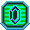
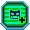
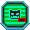

# Spectrobe Pet
A program that draws impermanent virtual Spectrobes directly on your Desktop that can exist as an overlay even while you are doing other tasks.  
Spectrobe pets can be interacted with in many ways.  
There are no consequences or perpetuity to the Spectrobe pets. Give them as much or as little attention as you would like.

# Basic Controls
Click on the Spectrobe and drag to move the Spectrobe anywhere on the screen.  
Place cursor over the Spectrobe and use Mouse Wheel or or W/S Keys to make the Spectrobe bigger or smaller.
Quickly move cursor over the Spectrobe to pet the Spectrobe.  
Click on the Spectrobe to activate its **Menu**. Click again to deactivate.  

# Menu Functions 
##  Switch Spectrobe
Click to activate.  
While activated, Spectrobe will be highlighted indicating it is in Species Switch mode.  
Use Mouse Wheel or W/S Keys to cycle through Spectrobe species.  
Click button again to deactivate.  

##  Rotate Mode
Click to activate.  
While activated, Spectrobe will be highlighted indicating it is in Rotate mode.  
Click-and-drag will no longer move the Spectrobe but instead Rotate it along its X and Y axis.  
Use Q/E Keys to rotate it along its Z axis.  
Click button again to deactivate.  

##  Walk Mode
Click to activate.  
While activated, Spectrobe will randomly walk around your screen along whatever orientation you had rotated it to.  
Spectrobe will not walk while the menu is activated.  
Click button again to deactivate.  

##  Help
Click to open this Help page.  

##  Mineral
Click to spawn a Mineral in a random location on the screen.  
Minerals have physics and can be dragged and thrown by the mouse cursor.  
Spectrobes will eat the mineral if they collide with it.  
Spectrobes who have not eaten Minerals in a while may trigger a "Sad" or "Angry" animation. This does not have any effect.  

##  Add Spectrobe
Click to add another Spectrobe to the screen.  

##  Remove Spectrobe
Click to remove this Spectrobe from the screen.  
Does not work if this is the only remaining Spectrobe.  

##  Quit
Closes the Spectrobe Pet program entirely.  
